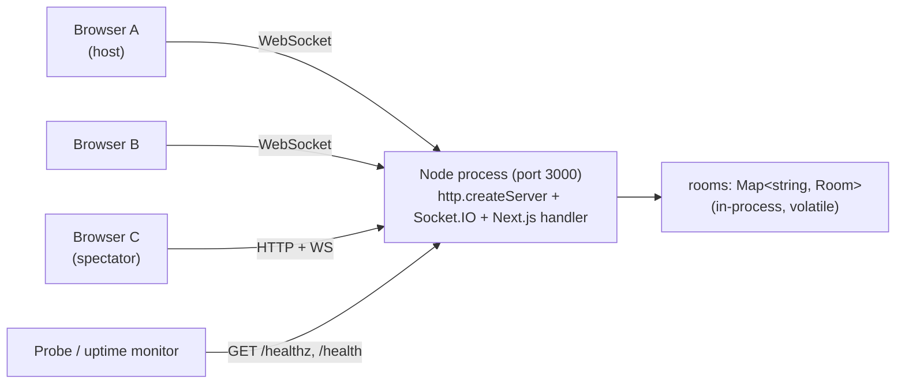
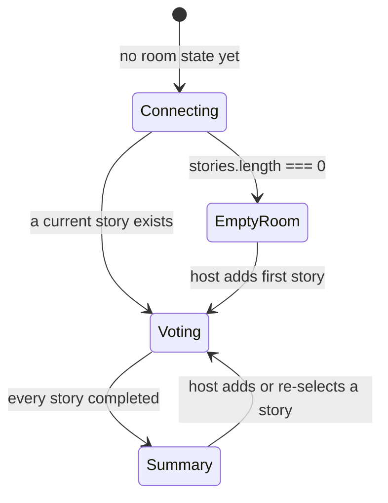
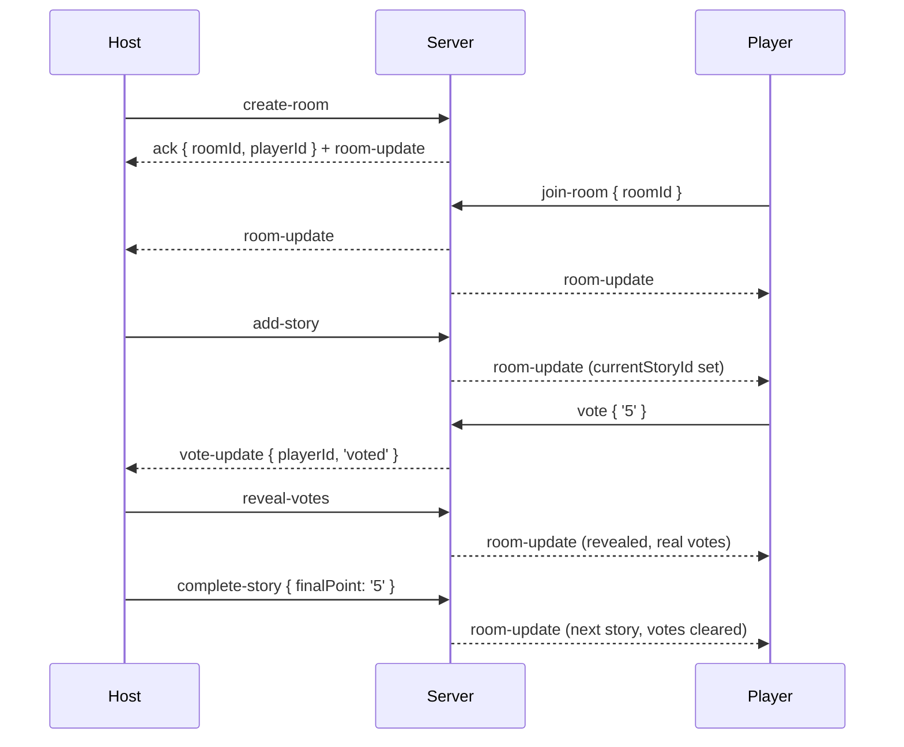

# Scrum Poker — Technical Specification

**Version:** 2.0.0 · **Status:** as-built (documents the system as it exists at commit `47517b0`, branch `feature/donate`)

This is an as-built architecture document, not a proposal. Everything below is derived from
`server.ts` and `src/`, not from `README.md` / `CLAUDE.md` (both of which are partially stale).

---

## 1. System overview

Real-time planning poker. A host creates a room, shares a 6-character code or invite link,
the team adds stories, votes on them in secret, reveals together, and records a final point
per story. No accounts, no database, no persistence — a room lives in the server process's
memory and disappears when idle or when the process restarts.

### 1.1 Deployment topology



One process serves everything: Next.js page/asset requests, the `/healthz` and `/health`
endpoints, and the Socket.IO transport. There is no separate API tier, no REST surface, and
no external state store.

### 1.2 Runtime stack

| Layer | Technology |
|---|---|
| UI | Next.js 16.2.3 (App Router), React 19.2.4, Tailwind CSS 4 |
| Transport | Socket.IO 4.8 (client + server), WebSocket with polling fallback |
| Server | Node 22, custom `http` server in `server.ts`, executed by `tsx` (TypeScript is **not** pre-compiled) |
| State | `Map<string, Room>` in process memory |
| Audio | Web Audio API (synthesised, no audio files) + Web Speech API (TTS) |
| Tests | Vitest 4 + Testing Library + happy-dom |
| Packaging | Multi-stage Dockerfile, Next.js `output: "standalone"` |
| CI/CD | Jenkins, shared library `central-cicd-template` |

---

## 2. Process architecture

`server.ts` is the entry point for both dev (`npm run dev`) and production (`npm start`).
It boots Next.js in-process (`next({ dev, hostname, port })`), then creates a raw HTTP
server whose request handler routes:

| Path | Handler |
|---|---|
| `/healthz` | Liveness probe → `200 text/plain "ok"` |
| `/health` | Metrics → `200 application/json` (see §7.2) |
| everything else | Next.js request handler |

Socket.IO attaches to the same HTTP server:

```ts
new SocketIOServer(httpServer, {
  cors: { origin: '*' },
  pingInterval: 25000,
  pingTimeout: 300000,
  maxHttpBufferSize: 1e5,
})
```

`pingTimeout` of 300 s is deliberately long (tolerates laptop sleep / tab throttling) and has
a direct consequence documented in §9.

### 2.1 Client architecture

Every page is a client component (`'use client'`). There is no server-side data fetching —
the server renders shell markup, then the socket connection populates everything.

| Route | File | Role |
|---|---|---|
| `/` | `src/app/page.tsx` | Create or join a room (tabbed), spectator opt-in |
| `/join/[id]` | `src/app/join/[id]/page.tsx` | Invite landing page — name entry, joins room `[id]` |
| `/room/[id]` | `src/app/room/[id]/page.tsx` | Voting room orchestrator (~474 lines) |
| `/sitemap.xml` | `src/app/sitemap.ts` | Home page only |
| `/robots.txt` | `src/app/robots.ts` | Disallows `/room/` and `/join/` |

Room-page children: `RoomHeader`, `StoryList` (sidebar), `PlayerArea` → `PlayerCard`,
`InteractionBar`, `VotingDeck`, `VoteStats` (dynamically imported, `ssr: false`),
`EmptyRoom`, `SummaryPage`.

Shared: `src/lib/socket.ts` (singleton client), `src/lib/sounds.ts`, `src/lib/theme.tsx`,
`src/lib/room-utils.ts` (**imported by both client and `server.ts`** — see §8.1),
`src/components/ThemeToggle.tsx`, `src/components/FloatingButton.tsx`.

The room page renders one of three states:



---

## 3. Data model

Verbatim from `src/types/index.ts`.

```ts
interface Player {
  id: string;            // === socket.id
  name: string;          // ≤ 20 chars, server-trimmed
  vote: string | null;
  isHost: boolean;
  isSpectator?: boolean;
}

interface Story {
  id: string;            // crypto.randomUUID()
  title: string;         // ≤ 200 chars
  finalPoint: string | null;
  completed: boolean;
}

interface Room {                        // server-side only
  id: string;                           // 6 chars, uppercase
  name: string;                         // ≤ 30 chars, default 'Scrum Poker'
  players: Map<string, Player>;
  revealed: boolean;
  votingSystem: string[];               // resolved deck, not the key
  lastActivity: number;                 // epoch ms
  stories: Story[];
  currentStoryId: string | null;
}

interface RoomState {                   // wire format sent to clients
  id, name, revealed, votingSystem, stories, currentStoryId
  players: Player[];                    // Map flattened, votes masked
}
```

Decks (`src/types/index.ts`):

- `FIBONACCI` — `0 1 2 3 5 8 13 21 34 55 89 ? ☕`
- `T_SHIRT` — `XS S M L XL XXL ? ☕`

`getVotingSystem(key)` maps `'tshirt'` → `T_SHIRT`, anything else → `FIBONACCI`. The room
stores the **resolved array**, so an unknown key silently degrades to Fibonacci rather than
erroring.

### 3.1 Identity model — the load-bearing decision

**`Player.id === socket.id`.** There is no user account, no cookie, no persistent client ID.
Consequences that propagate through the whole system:

- A page refresh produces a **new** player identity. The old `Player` is removed on
  `disconnect`; `rejoin-room` inserts a fresh one.
- Host status cannot follow a person across a refresh (§9.3).
- Server-side authorization is entirely "is the socket that sent this event flagged
  `isHost` in this room?" — nothing is signed or verified beyond that.
- Per-connection scope is held in two closure variables (`currentRoomId`, `currentPlayerId`)
  set at join time; every subsequent event resolves the room through them, so a client
  cannot address a room it never joined.

### 3.2 Room IDs

`ROOM_ID_CHARS = 'ABCDEFGHJKLMNPQRSTUVWXYZ23456789'` (32 chars; `I`, `O`, `0`, `1` excluded
to avoid transcription errors), length 6 → 32⁶ ≈ 1.07 × 10⁹ combinations. Generated with
`Math.random()` (not cryptographic) and re-rolled on collision with a live room. Join input
is uppercased on both client and server.

### 3.3 Client-side persistence

| Key | Store | Purpose |
|---|---|---|
| `playerName` | `sessionStorage` | Enables silent `rejoin-room` after refresh |
| `isSpectator` | `sessionStorage` | `'1'` / `'0'`, replayed on rejoin |
| `theme` | `localStorage` | `'light'` / `'dark'` |
| `scrumPokerMuted` | `localStorage` | Mutes all sound + TTS |
| `storySidebarCollapsed` | `localStorage` | `'1'` / `'0'` |

---

## 4. Real-time protocol

All communication is Socket.IO events. There is no REST API.

### 4.1 Client → Server

| Event | Payload | Ack | Auth | Server-side limits & rules |
|---|---|---|---|---|
| `create-room` | `{ playerName, roomName, votingSystem, asSpectator? }` | `{ success, roomId, playerId }` \| `{ success:false, error }` | any | name ≤ 20 (required), roomName ≤ 30 (default `Scrum Poker`); creator becomes host |
| `join-room` | `{ roomId, playerName, asSpectator? }` | same | any | room must exist; name ≤ 20 required; never host |
| `rejoin-room` | `{ roomId, playerName, asSpectator? }` | same | any | same as join, **plus** becomes host if the room currently has no host |
| `get-room-state` | — | `{ success, state? }` | joined socket | reads the room bound to this connection |
| `vote` | `{ vote: string \| null }` | — | joined, non-spectator | rejected if `revealed`, if `currentStoryId === null`, or if the value is not in `room.votingSystem` |
| `reveal-votes` | — | — | **host** | sets `revealed = true` |
| `reset-votes` | — | — | **host** | clears every vote, `revealed = false` |
| `add-story` | `{ title }` | — | **host** | title trimmed to 200; becomes current story if none is selected (and resets voting) |
| `update-story` | `{ storyId, title }` | — | **host** | title trimmed to 200, non-empty |
| `delete-story` | `{ storyId }` | — | **host** | if it was current, advances to the first incomplete story and resets voting |
| `select-story` | `{ storyId }` | — | **host** | no-op if already current; otherwise resets voting |
| `complete-story` | `{ finalPoint }` | — | **host** | value trimmed to 10 chars, non-empty; marks story complete, advances to next incomplete, resets voting |
| `transfer-host` | `{ targetPlayerId }` | — | **host** | target must exist and not be self |
| `send-emoji` | `{ emoji }` | — | joined | trimmed to 16 chars, non-empty; **not** validated against the emoji list |
| `send-chat` | `{ message }` | — | joined | trimmed to 50 chars, non-empty |

Host-only events use a shared `requireHost()` guard that returns the room or `null`.
All rejections are silent (no error emit) — the client simply sees no state change.
Mutating events bump `room.lastActivity`.

### 4.2 Server → Client

| Event | Payload | When |
|---|---|---|
| `room-update` | full `RoomState` | any structural change: join, rejoin, disconnect (if players remain), reveal, reset, any story mutation, host transfer |
| `vote-update` | `{ playerId, vote: 'voted' \| null }` | a single vote is cast or withdrawn — a narrow delta so casting a vote does not re-broadcast the whole room |
| `player-emoji` | `{ playerId, emoji }` | reaction sent (broadcast to all, including sender) |
| `player-chat` | `{ playerId, message }` | chat sent (broadcast to all; the sender's own message is not re-spoken by TTS) |

### 4.3 Vote secrecy

`getRoomState()` in `src/lib/room-utils.ts` is the single masking point:

```ts
vote: room.revealed ? p.vote : (p.vote ? 'voted' : null)
```

Actual vote values never leave the server before reveal — not in `room-update`, not in
`vote-update` (which sends the literal string `'voted'`). Opening devtools shows only
who has voted, never what. `VoteStats` filters the sentinel `'voted'` out defensively.

### 4.4 Session flow



### 4.5 Reconnection

The client uses one Socket.IO singleton with automatic reconnection
(`reconnectionDelay` 1 s → max 5 s, jitter 0.5). On every `connect` the room page runs
`get-room-state`; if the server reports no session it falls back to `rejoin-room` using
`sessionStorage.playerName`. If no stored name exists, the page redirects to `/join/[id]`.

---

## 5. Domain rules

**Voting.** Spectators are excluded from vote progress, "all voted" detection, and
`VoteStats`. Voting requires a current story. Clicking your current vote again withdraws it
(client sends `null`). Votes are cleared and `revealed` reset whenever the current story
changes (select, delete-current, complete) or on explicit `reset-votes`.

**Story queue.** Ordered list. The first added story auto-becomes current. `complete-story`
records `finalPoint` (free text ≤ 10 chars, typically a deck value) and advances to the
first story with `completed === false`. When no incomplete story remains, `currentStoryId`
becomes `null` and clients render `SummaryPage`.

**Host.** The creator is host. Exactly one host at a time via `transfer-host`. On host
disconnect, host passes to the first player in `Map` insertion order (i.e. earliest joiner
still present). If the room is empty of hosts, the next `rejoin-room` claims host.

**Statistics** (`VoteStats`, client-side, computed after reveal over non-spectators):
`?` and `☕` are excluded; average / min / max are computed over values that parse as
numbers (so a T-shirt deck shows distribution only); consensus is flagged when more than
one vote exists and all are identical; the distribution bar chart is percent of all
players passed in.

**Session total** (`SummaryPage`): sum of `parseFloat(finalPoint)` over stories where it
parses; `null` (hidden) if nothing numeric.

---

## 6. Room lifecycle & memory management

| Constant | Value | Meaning |
|---|---|---|
| `ROOM_TTL_MS` | 30 min | Idle rooms are deleted regardless of occupancy |
| `ROOM_EMPTY_GRACE_MS` | 60 s | Empty rooms survive this long, so a refresh can rejoin |
| `CLEANUP_INTERVAL_MS` | 30 s | Sweep frequency |

A single `setInterval` sweeps the map: delete if `players.size === 0 && idle > 60 s`, or if
`idle > 30 min`. `lastActivity` is only bumped by mutations — a room where everyone is
staring at revealed votes for 31 minutes is collected out from under them.

Disconnect handling: remove the player, bump `lastActivity`; if others remain, reassign host
if needed and broadcast `room-update`; if the room is now empty, **do nothing** and let the
grace period run.

Memory ceiling: bounded by field caps (name 20, room name 30, 200 chars × story count,
50-char chat is broadcast not stored) plus `maxHttpBufferSize` of 100 KB per message.
Story count itself is **unbounded** — a host can add stories indefinitely.

---

## 7. Operations

### 7.1 Configuration

| Variable | Default | Used by |
|---|---|---|
| `PORT` | `3000` | HTTP listener |
| `NODE_ENV` | — | `production` disables Next.js dev mode |
| `NEXT_PUBLIC_SITE_URL` | `https://scrum-poker.devonly.dev` | `sitemap.ts`, `robots.ts`, `metadataBase` (`.env.local` sets `http://localhost:3000`) |

### 7.2 Health endpoints

- `GET /healthz` → `200 "ok"`. Zero-cost liveness probe.
- `GET /health` → JSON:

```json
{ "status": "ok", "uptime": 1234, "rooms": 3, "players": 11,
  "connections": 11, "memory": { "rss": 120, "heapUsed": 60, "heapTotal": 90 } }
```

Player count is an O(rooms) walk, cached for 5 s so a tight probe loop cannot dominate CPU.
Memory figures are MB.

### 7.3 Build & container

`next.config.ts` sets `output: "standalone"`. The Dockerfile is three stages
(`deps` → `builder` → `runner`, all on `node:22-alpine`), runs as non-root `nextjs:nodejs`
(uid/gid 1001), and exposes 3000.

**Non-obvious requirement:** production runs TypeScript directly
(`CMD ["npx", "tsx", "server.ts"]`), so the runner stage installs `tsx`
(`npm install --no-save tsx`) and must explicitly `COPY` every source file `server.ts`
imports — currently `server.ts`, `src/types/`, `src/lib/room-utils.ts`, and `tsconfig.json`.
Next.js standalone tracing does **not** cover them, because they are not part of the Next
build graph. Any new `server.ts` import needs a matching `COPY` line or the container
crashes on start.

### 7.4 CI/CD

`Jenkinsfile` delegates to the shared library `central-cicd-template`:
`servicePipeline(projectType: 'node', serviceName: 'scrum-poker', nodeVersion: '20',
pkgManager: 'npm', testScript: 'test:coverage', hostPort: 3000, containerPort: 3000,
envFile: 'scrum-poker-env')`. The quality gate is `npm run test:coverage`.

Note the version skew: CI builds on Node 20, the container runs Node 22.

### 7.5 Testing

Vitest with happy-dom, `@` aliased to `src/`, coverage via v8 (lcov + text).
Suites in `src/__tests__/`: `components.test.tsx` (1310 lines), `room-utils.test.ts`,
`sounds.test.ts`, `types.test.ts`.

---

## 8. Cross-cutting concerns

### 8.1 Shared module boundary

`src/lib/room-utils.ts` is the only module imported by *both* the browser bundle and the
Node server (`src/types/index.ts` likewise, but it is types + constants). It must therefore
stay free of browser and Node-specific APIs. This is what makes vote masking testable in a
DOM test environment while running for real in the server process — and it is why the
Dockerfile has to copy it explicitly.

### 8.2 Theme

The `dark` class on `<html>` is the source of truth. An inline script in `layout.tsx` runs
**before hydration** to strip it for light-mode users (reading `localStorage.theme`, falling
back to `prefers-color-scheme`), preventing a flash. `ThemeProvider` subscribes to that class
via `useSyncExternalStore` rather than owning the state, so React never fights the script.
Server snapshot is always `'dark'`.

### 8.3 Audio & speech

All sounds are synthesised at runtime with the Web Audio API — oscillator + gain envelope,
no audio assets. A single lazily-created `AudioContext` is closed on `beforeunload`. Chat
messages are read aloud with the Web Speech API; Thai is detected by Unicode range
(`฀-๿`) and routed to a `th-TH` voice, otherwise `en-US`, with a preferred-voice
list and a language fallback. Chrome requires `cancel()` + 50 ms delay before `speak()`;
Safari breaks if you do — the code branches on user agent. TTS quality depends on voices
installed in the OS.

### 8.4 Ephemeral UI state

Floating emojis and chat bubbles live in `Map<playerId, item[]>` React state, auto-expiring
via `setTimeout` (2 s emojis, 3 s chat); at most 5 emojis are kept per player, 1 chat bubble.
All pending timeouts are cleared on unmount. Tab title changes to a notification string when
the tab is hidden and all players have voted or votes are revealed, and resets on
`visibilitychange`.

### 8.5 Input validation

Client `maxLength` attributes are a UX convenience only. The server re-validates
independently (`sanitizeName()` and inline `trim().slice()` per handler), because a raw
socket client can send anything. Vote values are whitelisted against the room's deck.
Emoji strings are length-capped but not whitelisted, so an arbitrary ≤16-char string can be
broadcast through `send-emoji`.

### 8.6 SEO

Full Open Graph / Twitter metadata on the root layout; `robots.txt` disallows `/room/` and
`/join/` so ephemeral session URLs are never indexed; sitemap lists only `/`.

---

## 9. Known limitations & constraints

These are properties of the current design, stated so they are not rediscovered in
production. None are bugs being fixed here.

1. **Single instance only — hard constraint.** Room state is in-process with no Redis
   adapter and no sticky-session configuration. Running two replicas behind a load balancer
   breaks rooms: clients land on different processes and see different worlds. Horizontal
   scaling requires a shared store *and* a Socket.IO adapter, not just more containers.
2. **All state is lost on restart or redeploy.** Every active session ends; there is no
   drain, warning, or recovery. Deploy when nobody is planning.
3. **`cors: { origin: '*' }`** on the Socket.IO server — any origin may open a socket.
   Given rooms are unauthenticated and identified only by a 6-character code, an attacker
   who guesses or obtains a code gets full player access; a guessed code plus an empty
   host slot (via `rejoin-room`) gets host.
4. **`pingTimeout: 300000`.** A client that dies without closing the transport (network
   drop, force-quit) stays in the player list for up to 5 minutes, counted in vote progress
   — so "all voted" may never fire. On an ungraceful reconnect the same person can appear
   twice, since the new socket joins before the old one's `disconnect` fires. A normal
   browser refresh closes cleanly and does not exhibit this.
5. **A host who refreshes does not get host back** in a populated room. Disconnect
   transfers host to the earliest remaining player, and `rejoin-room` only claims host when
   *no* host exists. Recovery requires the new host to `transfer-host` back. In an empty
   room (within the 60 s grace window) the refreshing host does reclaim it.
6. **Idle timeout is activity-based, not presence-based.** 30 minutes without a mutating
   event deletes the room even with people connected; they are dropped to `/join/[id]`.
7. **No server-side test coverage.** All four suites are client-side. `server.ts` — room
   lifecycle, authorization, masking, host transfer, GC — has no automated tests. The
   coverage gate in CI therefore says nothing about the highest-risk file in the repo.
8. **`uuid` and `@types/uuid` are unused dependencies.** `server.ts` uses
   `crypto.randomUUID`; nothing in `src/` or `server.ts` imports `uuid`.
9. **No rate limiting.** `send-chat` / `send-emoji` / `vote` can be emitted as fast as a
   client can loop; the only protections are the 100 KB message cap and Socket.IO's own
   transport behaviour.
10. **Unbounded story list.** Nothing caps `room.stories.length`.
11. **Room IDs use `Math.random()`** — fine against accidental collision (re-rolled on
    conflict), not against deliberate prediction.
12. **`npm start` runs TypeScript through `tsx` in production.** No type-check or compile
    step gates the server at runtime; a type error in `server.ts` surfaces as a crash on
    boot rather than a failed build.
13. **Documentation drift.** `CLAUDE.md`'s socket-event list predates story management,
    `transfer-host`, and `/health`; `README.md`'s file tree omits `FloatingButton.tsx`.
    Treat `server.ts` as the protocol's source of truth.
